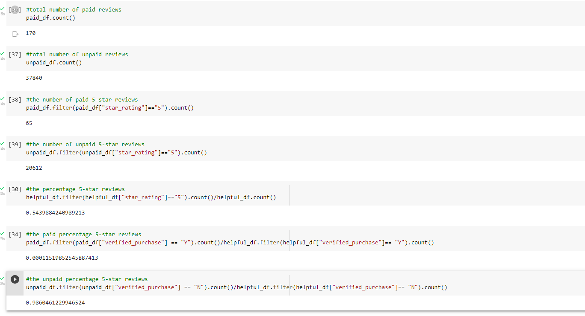

# Amazon_Vine_Analysis

## Overview of the analysis: 

    The purpose of this analysis is to analyze Amazon reviews written by members of the paid Amazon Vine program and use 
    PySpark to perform the ETL process to extract the dataset, transform the data, connect to an AWS RDS instance, and load 
    the transformed data into pgAdmin.

## Results: 

__How many Vine reviews and non-Vine reviews were there?__

•	There was a total of 170 vine reviews and  37840 non-vine reviews. 

__How many Vine reviews were 5 stars? How many non-Vine reviews were 5 stars?__

•	A total of 65 Vine reviews were 5 stars.
•	A total of 20612 non-Vine reviews were 5 stars.

__What percentage of Vine reviews were 5 stars? What percentage of non-Vine reviews were 5 stars?__

•	0.01151985254% of Vine reviews were 5 stars. 
•	98.60% of non-Vine reviews were 5 stars.

## Summary: 

__In your summary, state if there is any positivity bias for reviews in the Vine program. Use the results of your analysis to support your statement. Then, provide one additional analysis that you could do with the dataset to support your statement.__

After reviewing the data, it appears there is some positivity bias for reviews as the percentages of vine and non-vine reviews do not correlate with one another. The analysis is further supported by the total number of Vine reviews (65) and non-Vine reviews 20612 that were 5 stars.

